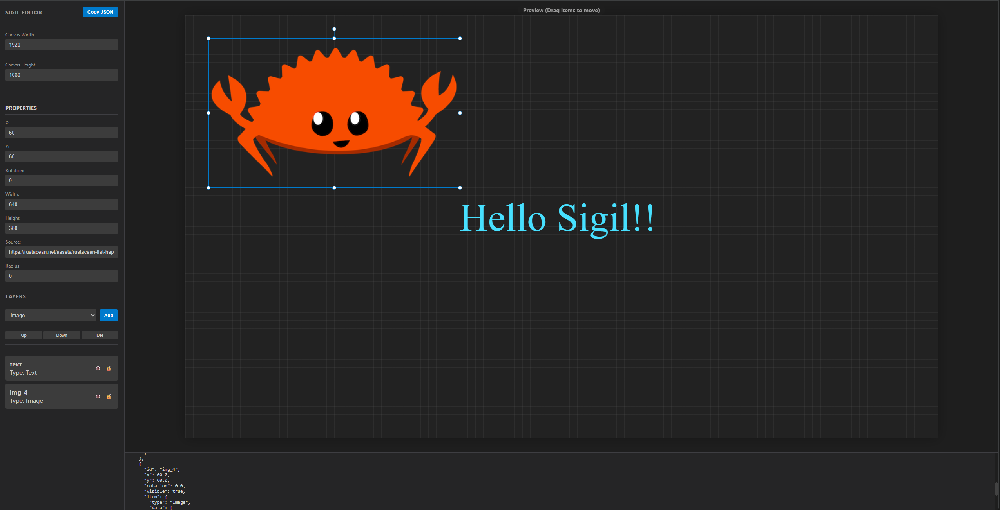

# Sigil

**Programmable Image Synthesis for the Modern Web**

 

 

## About

**Sigil** is a high-performance image composition engine designed to automate the creation of dynamic social assets. It treats graphics as code, allowing you to generate **OG images, welcome cards, and banners** server-side without launching a headless browser.

By separating the **visual definition** (declarative JSON schemas) from the **rendering logic** (Rust-based engine), Sigil provides a secure and scalable way to generate thousands of unique images on the fly.